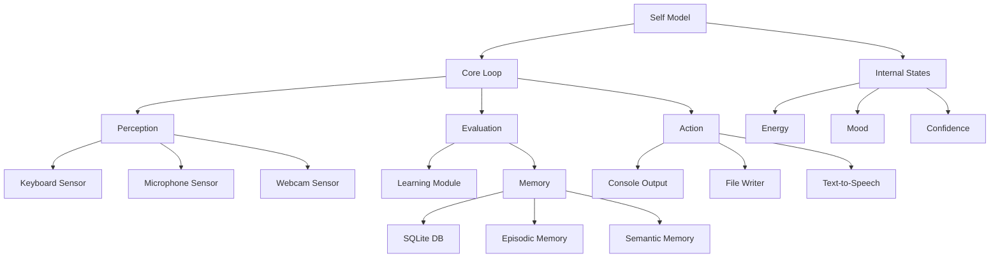

# AI Self-Aware Agent

A minimal self-aware agent prototype demonstrating core traits of a biological self, now with optional ChatGPT (OpenAI) and Claude (Anthropic) integration for advanced conversational abilities.

## Architecture



## Features

- **Internal Self-Model**: Simulated homeostasis with states like energy, mood, and confidence
- **Perception**: Input modules for keyboard, microphone, and webcam (with mock support)
- **Persistent Memory**: SQLite-based storage for episodic and semantic memory
- **Perception → Evaluation → Action Loop**: Core decision-making cycle
- **Metacognition**: Ability to introspect and verbalize internal states
- **Learning**: Q-learning implementation for action selection
- **Web interface** (localhost:5000)
- **Multiple AI Model Support**:
  - ChatGPT integration (if OpenAI API key is provided)
  - Claude integration (if Anthropic API key is provided)
- **Graceful fallback** to rule-based responses if no API keys or quota is available

## Prerequisites

- Node.js ≥ 20 LTS
- npm or yarn
- (Optional) Webcam and microphone for full sensor support

## Installation

1. Clone the repository:
   ```bash
   git clone https://github.com/yourusername/ai-self-aware-agent.git
   cd ai-self-aware-agent
   ```

2. Install dependencies:
   ```bash
   npm install
   ```

## Environment Variables
Create a `.env` file in the project root with your API keys:
```
OPENAI_API_KEY=sk-...your-openai-key-here...
ANTHROPIC_API_KEY=sk-ant-...your-anthropic-key-here...
```
If these variables are not set, the agent will run in local mode and provide basic fallback responses.

## Usage

### Basic Run
```bash
npm start
```

### Simulation Mode
```bash
npm run simulate
```

### Running Tests
```bash
npm test
```

### Web Interface (Recommended)
```bash
npm run web
```
Then open [http://localhost:5000](http://localhost:5000) in your browser.

### Available commands:
- `:introspect` — Show current internal state
- `:status` — Show current status
- `:help` — Show help message
- `:stop` — Stop the agent

## Example Session

```
> npm start
[Agent] Initializing...
[Agent] Internal state: { energy: 100, mood: 0.5, confidence: 0.7 }
[Agent] Ready for interaction

> hello
[Agent] Hi there! How can I help you today?

> :introspect
[Agent] Current state:
{
  "energy": 95,
  "mood": 0.6,
  "confidence": 0.75,
  "recentEvents": ["greeting_received", "introspection_requested"],
  "activeGoals": ["maintain_energy", "respond_to_user"]
}

> I'm feeling tired
[Agent] I notice you mentioned feeling tired. My energy level is at 90%. Would you like to take a break?
```

## Project Structure

```
src/
├── self.js           # Self model and homeostasis
├── core/
│   └── loop.js       # Main perception-action loop
├── sensors/
│   ├── keyboard.js   # Keyboard input
│   ├── microphone.js # Audio input
│   └── webcam.js     # Visual input
├── memory/
│   ├── db.js         # SQLite interface
│   └── types.js      # Memory type definitions
├── learning/
│   └── q-learning.js # Q-learning implementation
├── claude.js         # Claude API integration
└── actions/
    ├── console.js    # Console output
    └── file.js       # File writing
```

## Roadmap

1. **Phase 1: Enhanced Sensor Integration**
   - WebSocket-based real-time sensor synchronization
   - Improved sensor fusion algorithms
   - Multi-modal perception integration

2. **Phase 2: Advanced Self-Model**
   - Implementation of Integrated Information Theory (IIT) metrics
   - Enhanced module integration for higher Φ values
   - More sophisticated homeostasis simulation

3. **Phase 3: Deep Learning Integration**
   - Migration to deep reinforcement learning
   - Neural network-based policy optimization
   - Transfer learning capabilities

## Contributing

Contributions are welcome! Please read our contributing guidelines before submitting pull requests.

## License

MIT License - see LICENSE file for details 

## AI Model Integration Details

### ChatGPT Integration
- If `OPENAI_API_KEY` is set and valid, all user messages are sent to ChatGPT (e.g., `gpt-4` or `gpt-3.5-turbo`) and responses are shown in the web UI.
- If the key is missing, invalid, or you have exceeded your quota, the agent will display a clear message and echo the user's input as a fallback.

### Claude Integration
- If `ANTHROPIC_API_KEY` is set and valid, you can use Claude for responses by specifying `model: 'claude'` in your requests.
- Supports both regular chat and streaming responses.
- Available endpoints:
  - `/api/claude/chat` for regular responses
  - `/api/claude/stream` for streaming responses
- If the key is missing or invalid, the agent will fall back to other available models or local mode.

### Model Selection
- In the web interface, you can choose between available models
- The system will automatically fall back to available models if the primary choice is unavailable
- No API keys are required for local/rule-based mode

## Error Handling & Troubleshooting
- **401 Authentication Error:** Your API key is invalid or revoked. Create new keys at:
  - OpenAI: https://platform.openai.com/account/api-keys
  - Anthropic: https://console.anthropic.com/
- **429 Quota Error:** You have exceeded your API quota or rate limits. Check your usage and billing:
  - OpenAI: https://platform.openai.com/usage
  - Anthropic: https://console.anthropic.com/usage
- **Fallback Mode:** If API keys are missing, invalid, or quota is exceeded, the agent will continue to function with basic rule-based responses and will not crash.

## Security
- **Never commit your `.env` file or API keys to public repositories.** 