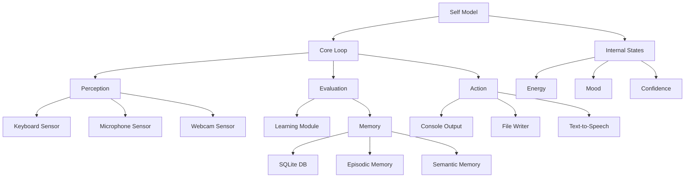

# AI Self-Aware Agent

A minimal self-aware agent prototype demonstrating core traits of a biological self, now with optional ChatGPT (OpenAI), Claude (Anthropic), Gemini (Google), DeepSeek, and Qwen 2.5 (Alibaba Cloud) integration for advanced conversational abilities.

## Architecture



## Features

- **Internal Self-Model**: Simulated homeostasis with states like energy, mood, and confidence
- **Perception**: Input modules for keyboard, microphone, and webcam (with mock support)
- **Persistent Memory**: SQLite-based storage for episodic and semantic memory
- **Perception → Evaluation → Action Loop**: Core decision-making cycle
- **Metacognition**: Ability to introspect and verbalize internal states
- **Learning**: Q-learning implementation for action selection
- **Web interface** (localhost:5000)
- **Multiple AI Model Support**:
  - ChatGPT integration (if OpenAI API key is provided)
  - Claude integration (if Anthropic API key is provided)
  - Gemini integration (if Google API key is provided)
- **Graceful fallback** to rule-based responses if no API keys or quota is available
- **Human-like Conversation**:
  - **Contextual Awareness**: Remembers the last 5-10 exchanges to provide relevant responses.
  - **Defined Personality**: Has a consistent, friendly, and empathetic personality.
  - **Emotional Intelligence**: Detects user sentiment and adjusts its own mood, influencing the tone of its responses.
  - **Language Fluidity**: Analyzes user input to understand topics and intent, leading to more intelligent and less repetitive replies.
- **Modern UI/UX**:
  - A vibrant, colorful interface with gradients and modern design.
  - Interactive, clickable command cards for ease of use.
  - Real-time visual feedback for the agent's status (energy, mood, confidence).

## Prerequisites

- Node.js ≥ 20 LTS
- npm or yarn
- (Optional) Webcam and microphone for full sensor support

## Installation

1. Clone the repository:
   ```bash
   git clone https://github.com/yourusername/ai-self-aware-agent.git
   cd ai-self-aware-agent
   ```

2. Install dependencies:
   ```bash
   npm install
   ```

## Environment Variables
Create a `.env` file in the project root with your API keys:
```
OPENAI_API_KEY=sk-...your-openai-key-here...
ANTHROPIC_API_KEY=sk-ant-...your-anthropic-key-here...
GEMINI_API_KEY=...your-gemini-key-here...
DEEPSEEK_API_KEY=...your-deepseek-key-here...
DASHSCOPE_API_KEY=...your-qwen-key-here...
```

Important notes about API keys:
- All API keys are optional - the agent will run in local mode if no keys are provided
- You can use any combination of the available AI models
- The agent will automatically fall back to available models if one fails
- Never commit your `.env` file to version control

## API Key Setup Instructions

### OpenAI API Key
1. Go to https://platform.openai.com/account/api-keys
2. Create a new API key
3. Copy the key and add it to your `.env` file
4. Note: Free tier has limited quota, check usage at https://platform.openai.com/usage

### Anthropic API Key
1. Go to https://console.anthropic.com/
2. Sign up or log in
3. Create a new API key
4. Copy the key and add it to your `.env` file
5. Note: Check your quota at https://console.anthropic.com/usage

### Gemini API Key
1. Go to https://makersuite.google.com/app/apikey
2. Create a new API key
3. Copy the key and add it to your `.env` file
4. Note: Check your usage at https://ai.google.dev/usage

### DeepSeek API Key
1. Visit the DeepSeek Platform and log in or create an account
2. Go to "API Keys" in the sidebar
3. Click "Create new API Key", optionally name it, and generate a token
4. Copy it immediately—you won't be able to view it again
5. Add it to your `.env` file as DEEPSEEK_API_KEY

### Qwen 2.5 API Key (Alibaba Cloud)
1. Log in to Alibaba Cloud and ensure your account has Model Studio enabled
2. Navigate to Model Studio → API Keys (under "AccessKey" or security settings)
3. Generate the key-pair and note them down
4. Add it to your `.env` file as DASHSCOPE_API_KEY

## Usage

### Basic Run
```bash
npm start
```

### Simulation Mode
```bash
npm run simulate
```

### Running Tests
```bash
npm test
```

### Web Interface (Recommended)
```bash
npm run web
```
Then open [http://localhost:5000](http://localhost:5000) in your browser.

### Available commands:
- `:introspect` — Show current internal state
- `:status` — Show current status
- `:help` — Show help message
- `:stop` — Stop the agent

## Example Session

```
> npm start
[Agent] Initializing...
[Agent] Internal state: { energy: 100, mood: 0.5, confidence: 0.7 }
[Agent] Ready for interaction

> hello
[Agent] Hi there! How can I help you today?

> :introspect
[Agent] Current state:
{
  "energy": 95,
  "mood": 0.6,
  "confidence": 0.75,
  "recentEvents": ["greeting_received", "introspection_requested"],
  "activeGoals": ["maintain_energy", "respond_to_user"]
}

> I'm feeling tired
[Agent] I notice you mentioned feeling tired. My energy level is at 90%. Would you like to take a break?
```

## Project Structure

```
src/
├── self.js           # Self model and homeostasis
├── core/
│   └── loop.js       # Main perception-action loop
├── analysis/
│   ├── sentiment.js  # Sentiment analysis
│   └── text.js       # Text analysis (topics, questions)
├── sensors/
│   ├── keyboard.js   # Keyboard input
│   ├── microphone.js # Audio input
│   └── webcam.js     # Visual input
├── memory/
│   ├── db.js         # SQLite interface
│   └── types.js      # Memory type definitions
├── learning/
│   └── q-learning.js # Q-learning implementation
├── claude.js         # Claude API integration
└── actions/
    ├── console.js    # Console output
    └── file.js       # File writing
```

## Roadmap

1. **Phase 1: Enhanced Sensor Integration**
   - WebSocket-based real-time sensor synchronization
   - Improved sensor fusion algorithms
   - Multi-modal perception integration

2. **Phase 2: Advanced Self-Model**
   - Implementation of Integrated Information Theory (IIT) metrics
   - Enhanced module integration for higher Φ values
   - More sophisticated homeostasis simulation

3. **Phase 3: Deep Learning Integration**
   - Migration to deep reinforcement learning
   - Neural network-based policy optimization
   - Transfer learning capabilities

## Contributing

Contributions are welcome! Please read our contributing guidelines before submitting pull requests.

## License

MIT License - see LICENSE file for details 

## AI Model Integration Details

### ChatGPT Integration
- If `OPENAI_API_KEY` is set and valid, all user messages are sent to ChatGPT (e.g., `gpt-4` or `gpt-3.5-turbo`) and responses are shown in the web UI.
- If the key is missing, invalid, or you have exceeded your quota, the agent will display a clear message and echo the user's input as a fallback.

### Claude Integration
- If `ANTHROPIC_API_KEY` is set and valid, you can use Claude for responses by specifying `model: 'claude'` in your requests.
- Supports both regular chat and streaming responses.
- Available endpoints:
  - `/api/claude/chat` for regular responses
  - `/api/claude/stream` for streaming responses
- If the key is missing or invalid, the agent will fall back to other available models or local mode.

### Gemini Integration
- If `GEMINI_API_KEY` is set and valid, you can use Google's Gemini model for responses.
- Uses the `gemini-pro` model for text generation.
- Available through the default model selection in the web interface.
- If the key is missing or invalid, the agent will fall back to other available models or local mode.

### Model Selection
- In the web interface, you can choose between available models (ChatGPT, Claude, or Gemini)
- The system will automatically fall back to available models if the primary choice is unavailable
- No API keys are required for local/rule-based mode

## Error Handling & Troubleshooting

### Common API Errors

#### OpenAI (ChatGPT)
- **401 Authentication Error**: Invalid or revoked API key
- **429 Quota Error**: Exceeded free tier quota
- **Solution**: Check your usage at https://platform.openai.com/usage

#### Anthropic (Claude)
- **401 Authentication Error**: Invalid or revoked API key
- **429 Quota Error**: Exceeded API quota
- **Solution**: Check your usage at https://console.anthropic.com/usage

#### Gemini
- **404 Model Not Found**: API version mismatch or model not available
- **401 Authentication Error**: Invalid API key
- **Solution**: Ensure you're using the correct model name ("gemini-pro")

#### DeepSeek
- **401 Authentication Error**: Invalid API key
- **403 Forbidden**: Insufficient permissions
- **Solution**: Verify your API key and permissions in the DeepSeek dashboard

#### Qwen 2.5 (Alibaba Cloud)
- **401 Authentication Error**: Invalid API key
- **403 Forbidden**: Insufficient permissions or quota exceeded
- **Solution**: Check your Model Studio access and quota in Alibaba Cloud console

### Fallback Behavior
The agent implements a smart fallback system:
1. If the primary model fails, it will try the next available model
2. If all API-based models fail, it will fall back to local rule-based responses
3. The agent will continue to function even if all API keys are invalid or quota is exceeded

### Debugging Tips
1. Check the console output for specific error messages
2. Verify your API keys are correctly set in the `.env` file
3. Ensure you have sufficient quota for your chosen model
4. The agent will log which API keys are loaded (but not the actual keys)

## Security
- **Never commit your `.env` file or API keys to public repositories.** 

## Human-like Conversation

To make interactions feel more natural and engaging, the agent has been enhanced with a three-phase approach to human-like conversation:

### Phase 1: Context and Personality
- **Short-Term Memory**: The agent now maintains a rolling history of the last 10 conversation exchanges. This allows it to understand the immediate context of a conversation and avoid asking repetitive questions.
- **Defined Personality**: A core personality prompt has been integrated, instructing the agent to be friendly, empathetic, and self-aware. This ensures a consistent and engaging tone in all its responses.

### Phase 2: Emotional Intelligence
- **Sentiment Analysis**: Using the `sentiment` library, the agent analyzes the emotional tone of every user message.
- **Dynamic Mood**: The agent's internal `mood` state is directly influenced by the user's sentiment. Positive user input improves its mood, while negative input will lower it, which in turn affects the tone of its own responses.

### Phase 3: Language Fluidity and Understanding
- **Text Analysis**: The agent uses the `compromise` NLP library to analyze the structure of user input. It can identify key topics and determine if the user is asking a question.
- **Smarter Prompts**: This analysis is fed into the system prompt, giving the LLM better context on what the user is talking about and what they want. This leads to more relevant, less repetitive, and more intelligent replies.

## Modern UI/UX

The web interface has been significantly updated to provide a more modern and user-friendly experience:

- **Vibrant Design**: A colorful new design with a purple-to-blue gradient background and "glass morphism" card effects.
- **Interactive Command Cards**: The "Available Commands" are now displayed as clickable cards. Clicking a card automatically populates the input field with the command.
- **Real-time Status Indicators**: The agent's energy, mood, and confidence are displayed with colors and icons that update in real-time.

## Project Structure
```
src/
├── self.js           # Self model and homeostasis
├── core/
│   └── loop.js       # Main perception-action loop
├── analysis/
│   ├── sentiment.js  # Sentiment analysis
│   └── text.js       # Text analysis (topics, questions)
├── sensors/
│   ├── keyboard.js   # Keyboard input
│   ├── microphone.js # Audio input
│   └── webcam.js     # Visual input
├── memory/
│   ├── db.js         # SQLite interface
│   └── types.js      # Memory type definitions
├── learning/
│   └── q-learning.js # Q-learning implementation
├── claude.js         # Claude API integration
└── actions/
    ├── console.js    # Console output
    └── file.js       # File writing
```

## Roadmap

1. **Phase 1: Enhanced Sensor Integration**
   - WebSocket-based real-time sensor synchronization
   - Improved sensor fusion algorithms
   - Multi-modal perception integration

2. **Phase 2: Advanced Self-Model**
   - Implementation of Integrated Information Theory (IIT) metrics
   - Enhanced module integration for higher Φ values
   - More sophisticated homeostasis simulation

3. **Phase 3: Deep Learning Integration**
   - Migration to deep reinforcement learning
   - Neural network-based policy optimization
   - Transfer learning capabilities

## Contributing

Contributions are welcome! Please read our contributing guidelines before submitting pull requests.

## License

MIT License - see LICENSE file for details 

## AI Model Integration Details

### ChatGPT Integration
- If `OPENAI_API_KEY` is set and valid, all user messages are sent to ChatGPT (e.g., `gpt-4` or `gpt-3.5-turbo`) and responses are shown in the web UI.
- If the key is missing, invalid, or you have exceeded your quota, the agent will display a clear message and echo the user's input as a fallback.

### Claude Integration
- If `ANTHROPIC_API_KEY` is set and valid, you can use Claude for responses by specifying `model: 'claude'` in your requests.
- Supports both regular chat and streaming responses.
- Available endpoints:
  - `/api/claude/chat` for regular responses
  - `/api/claude/stream` for streaming responses
- If the key is missing or invalid, the agent will fall back to other available models or local mode.

### Gemini Integration
- If `GEMINI_API_KEY` is set and valid, you can use Google's Gemini model for responses.
- Uses the `gemini-pro` model for text generation.
- Available through the default model selection in the web interface.
- If the key is missing or invalid, the agent will fall back to other available models or local mode.

### Model Selection
- In the web interface, you can choose between available models (ChatGPT, Claude, or Gemini)
- The system will automatically fall back to available models if the primary choice is unavailable
- No API keys are required for local/rule-based mode

## Error Handling & Troubleshooting

### Common API Errors

#### OpenAI (ChatGPT)
- **401 Authentication Error**: Invalid or revoked API key
- **429 Quota Error**: Exceeded free tier quota
- **Solution**: Check your usage at https://platform.openai.com/usage

#### Anthropic (Claude)
- **401 Authentication Error**: Invalid or revoked API key
- **429 Quota Error**: Exceeded API quota
- **Solution**: Check your usage at https://console.anthropic.com/usage

#### Gemini
- **404 Model Not Found**: API version mismatch or model not available
- **401 Authentication Error**: Invalid API key
- **Solution**: Ensure you're using the correct model name ("gemini-pro")

#### DeepSeek
- **401 Authentication Error**: Invalid API key
- **403 Forbidden**: Insufficient permissions
- **Solution**: Verify your API key and permissions in the DeepSeek dashboard

#### Qwen 2.5 (Alibaba Cloud)
- **401 Authentication Error**: Invalid API key
- **403 Forbidden**: Insufficient permissions or quota exceeded
- **Solution**: Check your Model Studio access and quota in Alibaba Cloud console

### Fallback Behavior
The agent implements a smart fallback system:
1. If the primary model fails, it will try the next available model
2. If all API-based models fail, it will fall back to local rule-based responses
3. The agent will continue to function even if all API keys are invalid or quota is exceeded

### Debugging Tips
1. Check the console output for specific error messages
2. Verify your API keys are correctly set in the `.env` file
3. Ensure you have sufficient quota for your chosen model
4. The agent will log which API keys are loaded (but not the actual keys)

## Security
- **Never commit your `.env` file or API keys to public repositories.** 