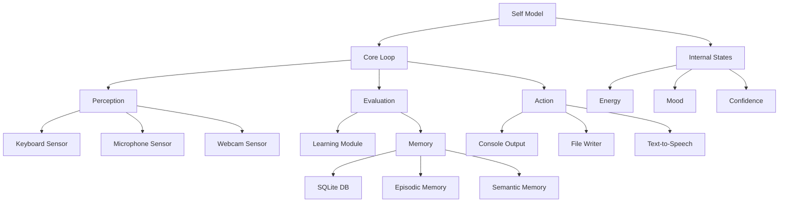

# AI Self-Aware Agent Prototype

A minimal self-aware agent prototype that emulates core traits of a biological "self" through Node.js. This project demonstrates how a synthetic "self" can arise through multi-source information integration, persistent internal representation, and a perception-action cycle with learning and self-reflection.

## Architecture



## Features

- **Internal Self-Model**: Simulated homeostasis with states like energy, mood, and confidence
- **Perception**: Input modules for keyboard, microphone, and webcam (with mock support)
- **Persistent Memory**: SQLite-based storage for episodic and semantic memory
- **Perception → Evaluation → Action Loop**: Core decision-making cycle
- **Metacognition**: Ability to introspect and verbalize internal states
- **Learning**: Q-learning implementation for action selection

## Prerequisites

- Node.js ≥ 20 LTS
- npm or yarn
- (Optional) Webcam and microphone for full sensor support

## Installation

1. Clone the repository:
   ```bash
   git clone https://github.com/yourusername/ai-self-aware-agent.git
   cd ai-self-aware-agent
   ```

2. Install dependencies:
   ```bash
   npm install
   ```

## Usage

### Basic Run
```bash
npm start
```

### Simulation Mode
```bash
npm run simulate
```

### Running Tests
```bash
npm test
```

## Example Session

```
> npm start
[Agent] Initializing...
[Agent] Internal state: { energy: 100, mood: 0.5, confidence: 0.7 }
[Agent] Ready for interaction

> hello
[Agent] Hi there! How can I help you today?

> :introspect
[Agent] Current state:
{
  "energy": 95,
  "mood": 0.6,
  "confidence": 0.75,
  "recentEvents": ["greeting_received", "introspection_requested"],
  "activeGoals": ["maintain_energy", "respond_to_user"]
}

> I'm feeling tired
[Agent] I notice you mentioned feeling tired. My energy level is at 90%. Would you like to take a break?
```

## Project Structure

```
src/
├── self.js           # Self model and homeostasis
├── core/
│   └── loop.js       # Main perception-action loop
├── sensors/
│   ├── keyboard.js   # Keyboard input
│   ├── microphone.js # Audio input
│   └── webcam.js     # Visual input
├── memory/
│   ├── db.js         # SQLite interface
│   └── types.js      # Memory type definitions
├── learning/
│   └── q-learning.js # Q-learning implementation
└── actions/
    ├── console.js    # Console output
    └── file.js       # File writing
```

## Roadmap

1. **Phase 1: Enhanced Sensor Integration**
   - WebSocket-based real-time sensor synchronization
   - Improved sensor fusion algorithms
   - Multi-modal perception integration

2. **Phase 2: Advanced Self-Model**
   - Implementation of Integrated Information Theory (IIT) metrics
   - Enhanced module integration for higher Φ values
   - More sophisticated homeostasis simulation

3. **Phase 3: Deep Learning Integration**
   - Migration to deep reinforcement learning
   - Neural network-based policy optimization
   - Transfer learning capabilities

## Contributing

Contributions are welcome! Please read our contributing guidelines before submitting pull requests.

## License

MIT License - see LICENSE file for details 